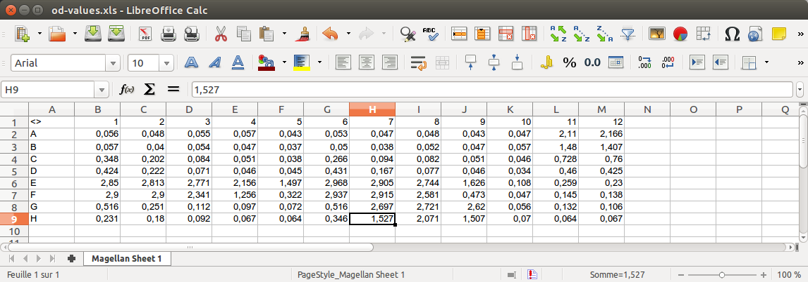
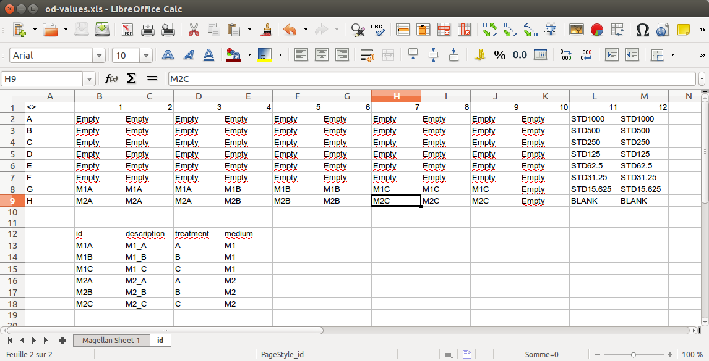
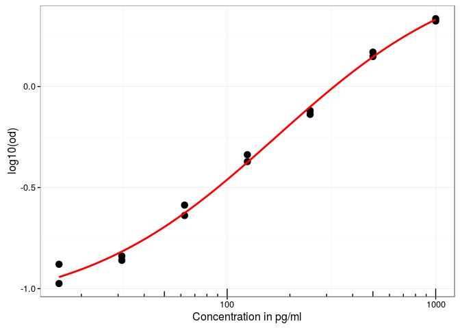

# ElisaR


> ElisaR can handle Tecan Sunrise excel exports which were modified to include the plate layout and sample identifications. It will perform a 4PL regression (using the `drc` library) and return a dataframe containing the concentrations corresponding to the O.D. values.

## Installation

```
devtools::install_git('https://github.com/koncina/elisar.git')
```

## Usage

### Prepare the Excel files

1. Export Tecan sunrise results as MS Excel `.xls` files.
2. Open the file (an example is shown in the screenshots below), duplicate the sheet and optionally rename it (e.g. `id`). The layout sheet **must be placed after** the original sheet.
3. On the duplicated sheet replace the O.D. values by unique identifiers for each sample and standard.
  - Unused wells can be specified by `empty` (case insensitive)
  - The blank value is specified by `blank` (case insensitive)
  - The standard values are constructed with a common leading `std.key` id (defaults to `STD` but can be adjusted in the `elisa.analyse()` function) merged to a trailing concentration value. For example: 250, 500 and 1000 pg/ml standard points would be encoded as STD250, STD500 and STD1000 (see wells in rows A-G and columns 11 to 12 in the second screenshot below).
4. It is possible to extend the identifications by placing a second table either below the layout or on a third sheet. The table should contain headers and requires the mandatory column `id` which should list all IDs reported in the layout. One can add as much columns as required to fully describe the data.

#### Screenshots

*Original Tecan Excel file:*


*Modified Tecan Excel file to include sample identifications:*


### Import the file in _R_


```r
library(elisar)
input <- read.tecan("od-values.xls")
input
```

```
## Source: local data frame [34 x 8]
## 
##             file   row column    id    od description treatment medium
##            (chr) (chr)  (chr) (chr) (dbl)       (chr)     (chr)  (chr)
## 1  od-values.xls     G      1   M1A 0.516        M1_A         A     M1
## 2  od-values.xls     H      1   M2A 0.231        M2_A         A     M2
## 3  od-values.xls     G      2   M1A 0.251        M1_A         A     M1
## 4  od-values.xls     H      2   M2A 0.180        M2_A         A     M2
## 5  od-values.xls     G      3   M1A 0.112        M1_A         A     M1
## 6  od-values.xls     H      3   M2A 0.092        M2_A         A     M2
## 7  od-values.xls     G      4   M1B 0.097        M1_B         B     M1
## 8  od-values.xls     H      4   M2B 0.067        M2_B         B     M2
## 9  od-values.xls     G      5   M1B 0.072        M1_B         B     M1
## 10 od-values.xls     H      5   M2B 0.064        M2_B         B     M2
## ..           ...   ...    ...   ...   ...         ...       ...    ...
```

### Perform the regression


```r
df <- elisa.analyse(input, transform = TRUE)
```

```
## 3 OD values are outside the standard range
```

```r
names(df)
```

```
## [1] "standard" "data"
```

The `elisa.analyse()` function returns a list containing the standard curve (used by the `elisa.standard()` function which will render it) and a dataframe with the analysed values.
**Note** that a warning is displayed when O.D. values are not within the range of standard points. These values are tagged as FALSE in the `.valid` column.


```r
head(df$data)
```

```
## Source: local data frame [6 x 11]
## 
##            file column   row    id description treatment medium
##           (chr)  (chr) (chr) (chr)       (chr)     (chr)  (chr)
## 1 od-values.xls      1     G   M1A        M1_A         A     M1
## 2 od-values.xls      1     H   M2A        M2_A         A     M2
## 3 od-values.xls      2     G   M1A        M1_A         A     M1
## 4 od-values.xls      2     H   M2A        M2_A         A     M2
## 5 od-values.xls      3     G   M1A        M1_A         A     M1
## 6 od-values.xls      3     H   M2A        M2_A         A     M2
##   concentration concentration.sd    od .valid
##           (dbl)            (dbl) (dbl)  (lgl)
## 1    156.051286        20.013581 0.516   TRUE
## 2     60.483971         9.617523 0.231   TRUE
## 3     67.554642         9.964759 0.251   TRUE
## 4     41.817043         8.552142 0.180   TRUE
## 5     14.732076         5.276934 0.112   TRUE
## 6      6.131447         3.043125 0.092   TRUE
```


```r
elisa.standard(df)
```



### Options for the regression

Some options of the `elisa.analyse()` can be adjusted. Refer to the help page to list them (`?elisa.analyse`).

## Known issues

During the testing phase using MS Excel 97-2003 files (*xls* extension), `readxl::read_excel()` sometimes imported cells containing text as "0.00" text values. The `read.tecan()` function should detect and correct wrongly imported cells. As `readxl` users report other [issues](https://github.com/hadley/readxl/issues) when dealing with Excel 97-2003 files, it is recommended to convert the Tecan Sunrise Excel files to the MS Excel 2007-2013 XML format (*xlsx* extension) after adding the layout and identification informations.

